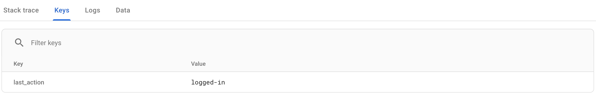

# Logging - Android

## Analytics

Typically we use [Firebase](https://firebase.google.com/docs/analytics) for as our analytics solution.

- [Get Started](https://firebase.google.com/docs/analytics/get-started?platform=android)

### Events

- [Event Logging](https://firebase.google.com/docs/analytics/events?platform=android)
- [Automatic Events](https://support.google.com/firebase/answer/6317485?hl=en&ref_topic=6317484)
- [Standard Events](https://support.google.com/firebase/answer/6317498?hl=en&ref_topic=6317484)
- [FirebaseAnalytics.Event](https://firebase.google.com/docs/reference/android/com/google/firebase/analytics/FirebaseAnalytics.Event)
- [FirebaseAnalytics.Param](https://firebase.google.com/docs/reference/android/com/google/firebase/analytics/FirebaseAnalytics.Param)

### User Properties

Setting [user properties](https://firebase.google.com/docs/analytics/user-properties?platform=android) is project specific. For some projects it may be helpful to be able to distil analytics by types of users, or users who have a particular trait.

### Screen Tracking

- [Screen tracking](https://firebase.google.com/docs/analytics/screenviews)

## Exceptions

Typically we use [Crashlytics](https://firebase.google.com/docs/crashlytics) to log our fatal and non-fatal exceptions.

- [Get Started](https://firebase.google.com/docs/crashlytics/get-started?platform=android)
- [Deobfuscation](https://firebase.google.com/docs/crashlytics/get-deobfuscated-reports?platform=android)

### Fatals

Any fatal crash will be automatically recorded. This will be uploaded to Firebase once the app has had a chance to do so.

### Non-fatals

Logging non fatal exceptions gives more insight into when expected errors occur. You can customise these by utilising the message within an exception. Kotlin and Java are very good at using exceptions and this is the preferred way of representing an error.

#### Custom exceptions

You can create custom exceptions to aid in the correct/consistent display of errors. For example:

```kotlin
// Exceptions.kt

package com.example.base.util

import java.io.IOException
import kotlin.reflect.KClass

open class ExpectedException(
    msg: String = "No message",
    override val cause: Throwable? = null
) : Exception("Expected Error: $msg", cause) {

    companion object {

        fun createNetworkException(
            dataSourceName: KClass<*>,
            methodName: String,
            cause: IOException
        ) = ExpectedException(
            msg = "Network (${dataSourceName.java.simpleName}.$methodName)",
            cause = cause
        )
    }
}
```

#### Tracking non-fatals

Typically we might add a library like [Napier](https://github.com/AAkira/Napier) to aid with logging. This can also be customised to send non fatal exceptions to Firebase with a [CrashlyticsAntilog](https://github.com/AAkira/Napier/blob/master/android/src/main/java/io/github/aakira/napier/sample/CrashlyticsAntilog.kt).

Otherwise we could add a function to some sort of `AnalyticsManager` to aid in non-fatal logging:

```kotlin
fun trackException(throwable: Throwable, clazz: KClass<*>?, log: Boolean = BuildConfig.DEBUG) {
    trackException(throwable = throwable, clazz = clazz?.java, log = log)
}

fun trackException(throwable: Throwable, clazz: Class<*>?, log: Boolean = BuildConfig.DEBUG) {
    if (log) {
        val tagName = if (clazz != null) {
            @Suppress("MagicNumber") // Tag name max chars is 23
            val tagLength = min(23, clazz.simpleName.length)
            clazz.simpleName.take(tagLength)
        } else {
            "Exception"
        }
        Log.e(tagName, throwable.message, throwable)
    }
    if (Fabric.isInitialized()) {
        Crashlytics.logException(throwable)
    }
}
```

You can also add helpful extensions for logging non-fatals:

```kotlin
// _Throwable.kt

package com.example.base.extension

import com.example.base.util.AnalyticsManager
import kotlin.reflect.KClass

fun Throwable.track(root: KClass<*>?) {
    AnalyticsManager.instance?.trackException(this, root)
}
```

#### Example

You can log an exception like this:

```kotlin
val cause = IOException("Some exception")
val exception = ExpectedException.createNetworkException(
    dataSourceName = AccountDataSource::class,
    methodName = "getUser()",
    cause = cause
)
exception.track(HomeFragment::class)
```

Which leads to this in the console:
```
Caused by com.example.base.util.ExpectedException
Expected Error: Network (AccountDataSource.getUser())
```
```
Caused by com.example.base.util.ExpectedException: Expected Error: Network (AccountDataSource.getUser())
       at com.example.base.util.ExpectedException$Companion.createNetworkException(Exceptions.kt:17)
       at com.example.home.HomeFragment$onViewCreated$1.invoke(HomeFragment.kt:58)
       at com.example.home.HomeFragment$onViewCreated$1.invoke(HomeFragment.kt:36)
       at android.view.View.performClick(View.java:7259)
       at com.google.android.material.button.MaterialButton.performClick(MaterialButton.java:967)
       at android.view.View.performClickInternal(View.java:7236)
       at android.view.View.access$3600(View.java:801)
       at android.view.View$PerformClick.run(View.java:27892)
       at android.os.Handler.handleCallback(Handler.java:883)
       at android.os.Handler.dispatchMessage(Handler.java:100)
       at android.os.Looper.loop(Looper.java:214)
       at android.app.ActivityThread.main(ActivityThread.java:7356)
       at java.lang.reflect.Method.invoke(Method.java)
       at com.android.internal.os.RuntimeInit$MethodAndArgsCaller.run(RuntimeInit.java:492)
       at com.android.internal.os.ZygoteInit.main(ZygoteInit.java:930)
```
```
Caused by java.io.IOException
Some exception
```
```
Caused by java.io.IOException: Some exception
       at com.example.home.HomeFragment$onViewCreated$1.invoke(HomeFragment.kt:57)
       at com.example.home.HomeFragment$onViewCreated$1.invoke(HomeFragment.kt:36)
       at android.view.View.performClick(View.java:7259)
       at com.google.android.material.button.MaterialButton.performClick(MaterialButton.java:967)
       at android.view.View.performClickInternal(View.java:7236)
       at android.view.View.access$3600(View.java:801)
       at android.view.View$PerformClick.run(View.java:27892)
       at android.os.Handler.handleCallback(Handler.java:883)
       at android.os.Handler.dispatchMessage(Handler.java:100)
       at android.os.Looper.loop(Looper.java:214)
       at android.app.ActivityThread.main(ActivityThread.java:7356)
       at java.lang.reflect.Method.invoke(Method.java)
       at com.android.internal.os.RuntimeInit$MethodAndArgsCaller.run(RuntimeInit.java:492)
       at com.android.internal.os.ZygoteInit.main(ZygoteInit.java:930)
```

#### Customising crash reports

If you would like to log any extra information to accompany the crash reports you can do so.

https://firebase.google.com/docs/crashlytics/customize-crash-reports?platform=android

##### Example

Adding:

```kotlin
Crashlytics.setString("last_action", "logged-in")
```

leads to this showing in the console



## Performance Monitoring

We use [Firebase](https://firebase.google.com/docs/perf-mon) to help with performance monitoring.

- [Get Started](https://firebase.google.com/docs/perf-mon/get-started-android)

## Other links

- https://firebase.google.com/docs/analytics/extend-with-functions
